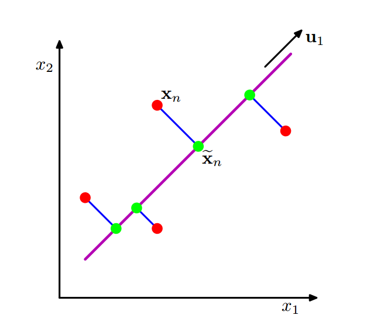
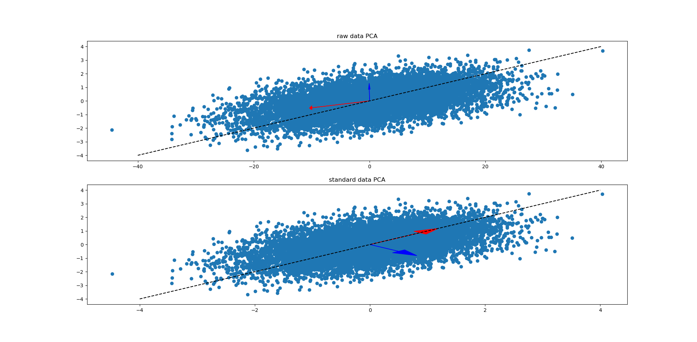

# 主成分分析PCA

[TOC]


## PCA简介

​		主成分分析（Principal component analysis, PCA）在降维、有损数据压缩、特征抽取、数据可视化等领域被广泛应用。

​		PCA的主要思想是将数据从$n$维特征空间映射到$k$维特征空间，即数据正交投影到低维线性空间。PCA通常有两种定义，两者等价。一种使投影数据的方差最大，把方差当做是数据包含的信息，那么投影方差最大化说明投影数据保留更多的信息；还有一种是使数据点和它们的投影之间的平均平方距离最小，这说明数据投影是损失最少的信息[1]。



## 方差最大化数学推导

​		考虑一组观测数据$\{x_i\}, i=1,2,...,n$，第$i$个样本$x_i$是一个$D$维欧几里得空间中的变量，这里为了适应线性变换的公式，$x_i$设为**列向量**（一般情况下我们认为数据集的行向量是样本，列向量是特征），我们的目标是将数据投影到维度$M<D$的空间中，同时最大化投影数据的方差。

### 第一主成分

​		首先考虑在一维空间$(M=1)$上的投影。用$D$维向量$\mu_1$定义这个空间的方向，因为我们只考虑投影空间的方向，所以假设$\mu_1$是一个单位向量，即$\mu_1^T\mu_1=1$（同时便于计算）。因此$x_i$在$\mu_i$上的投影为$\mu_1^T x_i$，所以投影数据的方差为
$$
\begin{align}
\frac{1}{n} \sum_{i=1}^n (\mu_1^T x_i - \mu_1^T \bar{x_i})^2 
& = \frac{1}{n} \sum_{i=1}^n (\mu_1^T (x_i - \bar{x_i}))^2 \\
& = \frac{1}{n} \sum_{i=1}^n \mu_1^T (x_i - \bar{x_i}) (x_i - \bar{x_i})^T \mu_1 \\
& = \mu_1^T \Sigma \mu_1
\end{align}
$$


​		其中$\Sigma =  \frac{1}{n} \sum_{i=1}^n  (x_i - \bar{x_i}) (x_i - \bar{x_i})^T $是$\{x_i\}$每个**特征**之间的**协方差矩阵**。

​		所以问题转化
$$
\begin{align}
max \quad &\mu_1^T \Sigma \mu_1 \\
s.t. \quad &\mu_1^T\mu_1=1
\end{align}
$$
​		使用拉格朗日乘子法来求解该等式约束问题：
$$
l=\mu_1^T \Sigma \mu_1-\lambda_1(\mu_1^T\mu_1-1)
$$
​		对$\mu_1$求导
$$
\begin{align}
\nabla_{\mu_1}l
&=\nabla_{\mu_1}(\mu_1^T\Sigma\mu_1)-\lambda_1(\mu_1^T\mu_1-1)
=\nabla_{\mu_1}\mu_1^T\Sigma\mu_1-\lambda_1\nabla_{\mu_1}\mu_1^T\mu_1 \\
&=\nabla_{\mu_1}tr(\mu_1^T\Sigma\mu_1)-\lambda_1\nabla_{\mu_1}tr(\mu_1^T\mu_1)
=(\nabla_{\mu_1^T}tr(\mu_1^T\Sigma\mu_1))^T-\lambda_1(\nabla_{\mu_1^T}tr(\mu_1^T\mu_1))^T \\
&=\Sigma\mu_1-\lambda_1\mu_1
\end{align}
$$
​		令导数等于$0$，即$\Sigma\mu_1=\lambda_1\mu_1$，这说明$\mu_1是\Sigma$的特征向量。

​		左乘$\mu_1^T$可得$\mu_1^T\Sigma\mu_1=\mu_1^T\lambda_1\mu_1=\lambda_1$，即数据在$\mu_1$上的投影的方差是$\lambda_1$，所以协方差矩阵$\Sigma$的**最大特征根**所对应的特征向量就是我们要找的投影方向，这个特征向量被称为**第一主成分**。

### 如何确定剩下的主成分？

​		每个主成分之间应该是正交的（否则会出现信息相关，没有意义），即对应于$k$维特征空间中的基。在最大主成分的推导过程中，我们发现投影数据的方差正好是原始数据协方差矩阵$\Sigma$的特征根，投影方向是特征根对应的特征向量，而特征根所对应的不同特征向量相互正交。所以在确定了第一主成分之后，第二主成分是协方差矩阵$\Sigma$第二大的特征根所对应的特征向量，第三主成分以此类推……

​		选取最大的$k$个特征值所对应的特征向量，降维后的数据可以用下式来表示：
$$
y_i=
\left[\begin{matrix}
\mu_1^T(x_i-\bar{x_i}) \\
\mu_2^T(x_i-\bar{x_i}) \\
\vdots \\
\mu_k^T(x_i-\bar{x_i})
\end{matrix}\right]
$$


### 时间复杂度分析

​		主成分分析涉及到计算数据集的均值$\bar{x}$和协方差矩阵$\Sigma$，然后寻找$\Sigma$的对应于$k$个最大特征值的$k$个特征向量。其中计算一个$D\times D$矩阵所有的特征向量的时间复杂度是$O(D^3)$。如果只将数据投影到前$k$个主成分中，那么我们只需寻找前$k$个特征值和特征向量。这可以使用更高效的方法得到，例如幂方法，时间复杂度为$O(kD^2)$，或者使用$EM$算法。

### PCA是否需要数据标准化

​		设$X_{n\times p}$是原始数据，**这里$n$表示样本数量，$p$表示特征数量**，与上述推导时相反，符合平时使用的格式，保证在代码实现时的同一性。

1. 数据是否需要中心化

   从上面的推导可以看出，在计算$X_{n\times p}$的协方差矩阵$\Sigma$时，每一项都减去了均值，也就相当于进行了中心化，所以使用**协方差矩阵**时不需要对数据进行中心化。如果事先进行了中心化，可以用**$X^TX$**来代替协方差矩阵。

2. 数据是否需要去量纲

   一个样本有很多特征，如果这些特征之间的数值或者数量级存在很大差异，那么在主成分时会往数量级大的特征偏移。因为主成分的定义是使数据投影之后方差最大，而方差是跟量纲相关的，也就是说**不同数量级的数据的方差进行比较时，方差大的不一定表示数据离散程度高**，所以最后求得的主成分的方向会偏向数量级高的特征方向。下节会用实验在验证上述观点。

3. 去量纲方法

   数据标准化方法具体介绍参见博文[数据预处理之数据无量纲化(标准化/归一化)](https://blog.csdn.net/OnTheWayGoGoing/article/details/79871559)[2]，摘取其中一段：

   >  $z-score$标准化方法试图将原始数据集标准化成均值为0，方差为1且接近于标准正态分布的数据集。相对于$min-max$归一化方法，该方法不仅能够去除量纲，还能够把所有维度的变量一视同仁（因为每个维度都服从均值为0，方差为1的正态分布），所以需要让每个维度发挥相同的作用时，使用此方法。相反地，如果想保留原始数据中由标准差所反映的潜在权重关系应该选择$min-max$归一化

   这段话看起来似乎是说PCA应该使用$min-max$归一化，因为这个方法保留了原始数据的标准差，而PCA正是通过方差最大化来确定主成分。但是，**PCA所谓的方差最大化指的是投影之后的数据的方差最大化！！！**，所以我们应该选择**$z-score$标准化方法来避免原始数据的标准差对主成分的影响**。

​		总结：

1. 如果数据已去量纲且中心化，可用**$X^TX$**来计算主成分；
2. 如果数据已去量纲但没有中心化，可用**协方差矩阵**来计算主成分；
3. 如果数据未标准化，可用**相关系数矩阵**来计算主成分。

## 用Python的sklearn库实现PCA


### sklearn中几种主要的PCA类

​		在scikit-learn中，与PCA相关的类都在sklearn.decomposition包中。最常用的PCA类就是sklearn.decomposition.PCA，我们下面主要也会讲解基于这个类的使用的方法。

​		除了PCA类以外，最常用的PCA相关类还有KernelPCA类，它主要用于非线性数据的降维，需要用到核技巧。因此在使用的时候需要选择合适的核函数并对核函数的参数进行调参。

​		另外一个常用的PCA相关类是IncrementalPCA类，它主要是为了解决单机内存限制的。有时候我们的样本量可能是上百万+，维度可能也是上千，直接去拟合数据可能会让内存爆掉， 此时我们可以用IncrementalPCA类来解决这个问题。IncrementalPCA先将数据分成多个batch，然后对每个batch依次递增调用partial_fit函数，这样一步步的得到最终的样本最优降维。

​		此外还有SparsePCA和MiniBatchSparsePCA。他们和上面讲到的PCA类的区别主要是使用了L1的正则化，这样可以将很多非主要成分的影响度降为0，这样在PCA降维的时候我们仅仅需要对那些相对比较主要的成分进行PCA降维，避免了一些噪声之类的因素对我们PCA降维的影响。SparsePCA和MiniBatchSparsePCA之间的区别则是MiniBatchSparsePCA通过使用一部分样本特征和给定的迭代次数来进行PCA降维，以解决在大样本时特征分解过慢的问题，当然，代价就是PCA降维的精确度可能会降低。使用SparsePCA和MiniBatchSparsePCA需要对L1正则化参数进行调参。[3]

### PCA类介绍

​	本节主要介绍sklearn.decomposition.PCA。

#### 超参数

1. **n_components:** 用来指定降维后的特征数量。一种是指定特征个数，此时n_components是大于等于1的整数。也可以指定主成分的方差所占的最小比例阈值，此时n_components是属于区间$(0, 1]$。也可以设置为"mle"，此时PCA类会用$MLE$算法根据特征的方差分布情况自己去选择一定数量的主成分特征来降维。如果不输入n_components，此时n_components=min(样本数，特征数)。
2. **whiten:** 是否白化，默认是False。如果是True，输出的特征的方差1，即`transofrom(X)`输出的主成分的方差为1.
3. **svd_solver:** 指定SVD分解的方法。有4个可以选择的值：{‘auto’, ‘full’, ‘arpack’, ‘randomized’}。randomized一般适用于数据量大，数据维度多同时主成分数目比例又较低的PCA降维，它使用了一些加快SVD的随机算法。 full则是传统意义上的SVD，使用了scipy库对应的实现。arpack和randomized的适用场景类似，区别是randomized使用的是scikit-learn自己的SVD实现，而arpack直接使用了scipy库的sparse SVD实现。默认是auto，即PCA类会自己去在前面讲到的三种算法里面去权衡，选择一个合适的SVD算法来降维。一般来说，使用默认值就够了。

#### 成员方法

1. **`fit(X)`:** 输入需要降维的数据，列向量是特征，行向量是样本，训练模型。
2. **`transfrom(X)`:** 输入需要降维的数据，返回主成分。
3. **`fit_transform(X)`:** 用X来训练PCA模型，同时返回降维后的数据，相当于`fit`和`transform`的组合。
4. **`inverse_transform(X)`:** 将降维后的数据转换成原始数据。

#### 成员变量

1. **`components_`:** 主成分，即上文的$u$，$(X-\bar{X})\mu^T=trainsform(X)$。
2. **`explained_variance_:`** 降维后各主成分的方差，方差越大，说明主成分越重要。
3. **`explained_variance_ratio_`:** 降维后各主成分方差所占的比例。
4. **`n_components_ `:** 主成分个数。

#### 代码实现

首先，用二维正态分布生成数据，协方差矩阵为[[1, 0.5], [0.5, 1]]，并在x轴上拉伸10倍

```python
import numpy as np
np.random.seed(0)
n = 10000
mu = [0, 0]
cov = np.array([[1, 0.5], [0.5, 1]])
X = np.random.multivariate_normal(mu, cov, n)
xd1 = np.linspace(-40, 40, 100)
xd2 = np.linspace(-4, 4, 10)
```

对数据进行$z-score$标准化

```python
from sklearn.preprocessing import StandardScaler
X = X * [10, 1]
scaler = StandardScaler()
scaler.fit(X)
X_standard = scaler.transform(X)
```

画出原始数据和标准化之后的数据

```python
plt.figure()
plt.subplot(211)
plt.plot(xd1, xd1 / 10, "--k")
plt.scatter(X[:, 0], X[:, 1])
plt.title("raw data")
plt.subplot(212)
plt.plot(xd2, xd2, "--k")
plt.scatter(X_standard[:, 0], X_standard[:, 1])
plt.title("standard data")
plt.show()
plt.close()
```

结果如下


创建PCA对象并训练

```python
# 使用原始数据
model1 = PCA()
model1.fit(X)
# 使用z-score之后的数据
model2= PCA()
model2.fit(X_standard)
# 输出结果
print("principal component: \n{}".format(model2.components_))
print("principal component variance: \n{}".format(model2.explained_variance_))
print("principal component variance ratio in total variance: \n{}".format(model2.explained_variance_ratio_))
print("principal component: \n{}".format(model2.transform(X_standard)))
```


输出结果

```python
principal component: 
[[ 0.707  0.707]
 [ 0.707 -0.707]]
principal component variance: 
[1.507 0.493]
principal component variance ratio in total variance: 
[0.753 0.247]
principal component: 
[[-2.189 -0.278]
 [-1.217 -1.591]
 [-2.319  0.703]
 ...
 [ 1.237 -0.194]
 [ 0.121  0.043]
 [ 1.293  0.232]]
```

##### 数据标准化前后的PCA结果比较

比较数据经过$z-score$标准化前后的PCA结果，很明显，未经过标准化的数据的第一主成分会往量纲大的方向偏移

```python
plt.figure()
# 原始数据的PCA结果
plt.subplot(211)
plt.scatter(X[:, 0], X[:, 1])
components1 = model1.components_
variance1 = np.sqrt(model1.explained_variance_)
plt.plot(xd1, xd1 / 10, "--k")
plt.arrow(0, 0, components1[0, 0]*variance1[0], components1[0, 1]*variance1[0], color='red', head_width=.3)
plt.arrow(0, 0, components1[1, 0]*variance1[1], components1[1, 1]*variance1[1], color='blue', head_width=.3)
plt.title("raw data PCA")
# 经过标准化的数据的PCA结果
plt.subplot(212)
plt.scatter(X_standard[:, 0], X_standard[:, 1])
components2 = model2.components_
variance2 = np.sqrt(model2.explained_variance_)
plt.plot(xd2, xd2, "--k")
plt.arrow(0, 0, components2[0, 0]*variance2[0], components2[0, 1]*variance2[0], color='red', head_width=.3)
plt.arrow(0, 0, components2[1, 0]*variance2[1], components2[1, 1]*variance2[1], color='blue', head_width=.3)
plt.title("standard data PCA")
plt.show()
```

结果如下



## reference

[1] Pattern Recognition and Machine Learning, Christopher M. Bishop

[2] [数据预处理之数据无量纲化(标准化/归一化)](https://blog.csdn.net/OnTheWayGoGoing/article/details/79871559)

[3] [用scikit-learn学习主成分分析(PCA)](https://www.cnblogs.com/pinard/p/6243025.html)

