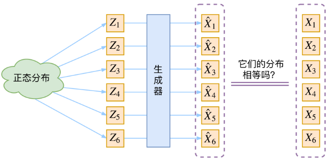
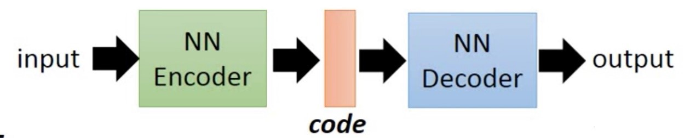
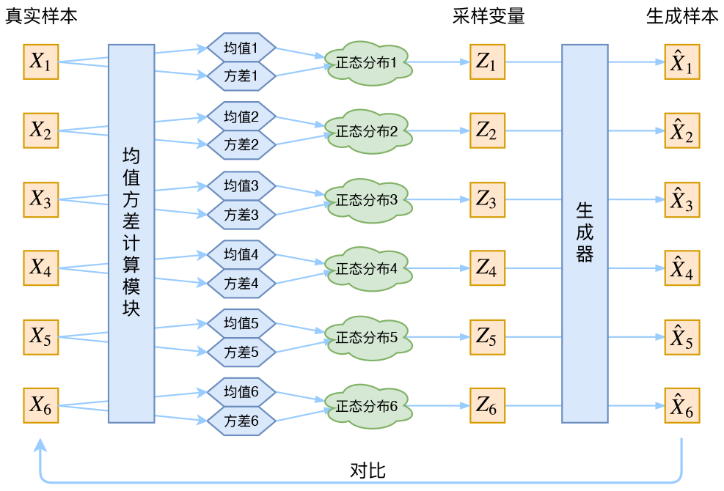
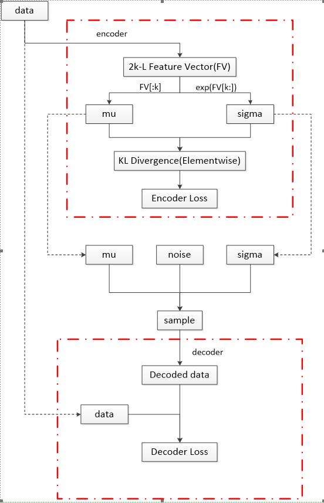
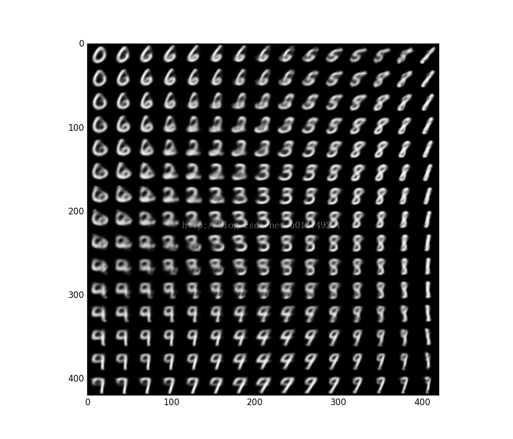

# 变分自编码器VAE

[TOC]

## 1. 生成模型

生成模型是指能够随机生成观测数据的模型，尤其是在给定某些隐含参数的条件下。它给观测值和标注数据序列指定一个联合概率分布。在机器学习中，生成模型可以用来直接对数据建模（例如根据某个变量的概率密度函数进行数据采样），也可以用来建立变量间的条件概率分布。条件概率分布可以由生成模型根据贝叶斯定理形成。

生成模型的根本目的是根据给出的样本$\{X_1,X_2,...,X_n\}$，求出这个样本的总体分布$p(X)$。如果能求出的话，那就可以直接根据$p(X)$来采样，得到所有可能的$X$了。但是现实中直接对数据样本建模求出数据的分布往往是十分困难的，需要用一些技巧，间接地来求解$p(X)$。现在最流行的两种生成模型VAE和GAN都是通过假设有一组服从某些常见分布（比如正态分布）的隐变量$Z$，然后训练一个模型$X=g(Z)$，将$Z$的概率分布映射到原始数据集的概率分布。这样在生成数据时只需要先从$Z$的分布中进行采样，然后做一次映射，即可生成服从原始数据集分布的数据。



## 2. 变分自编码器VAE

变分自编码器（Variational Autoencoder，VAE）由[Diederik P Kingma](https://arxiv.org/search/stat?searchtype=author&query=Kingma%2C+D+P)和[Max Welling](https://arxiv.org/search/stat?searchtype=author&query=Welling%2C+M)在2013年发表的论文[Auto-encoding Variational Bayes](https://arxiv.org/abs/1312.6114)中首次提出，这篇论文比较晦涩难懂，不过从原始数据的分布推导到自编码器一气呵成，令人叹为观止。[Carl Doersch](https://arxiv.org/search/stat?searchtype=author&query=Doersch%2C+C)在2016年写了一篇关于VAE的[tutorial](https://arxiv.org/abs/1606.05908)，详细介绍了VAE，并且更加易懂。

VAE是一种深度生成模型，其思想是利用神经网络来建立一个把可观测变量映射为隐变量的编码器和把隐变量映射为可观测变量的解码器，这种编码-解码的结构和自编码器比较类似，不同点在于变分自编码器中的编码器的输出是概率分布。

## 2.1 自编码器

要讲变分自编码器，自然要先讲自编码器。自编码器实质上是一种有损压缩算法，结构图如下所示：



高维的输入数据通过一种变换$f$（常用神经网络）变到一组低维的数据（可以称为**隐变量**），然后再用另一种变换$g$（常用神经网络）还原到原来的数据，即$X_i\stackrel{f}\rightarrow Z_i\stackrel{g}\rightarrow \hat{X_i}$，这个过程称为**编码-解码**。

然后设计一种度量$D(\hat{X_i}, X_i)$描述还原后的数据和原始数据的相似度，就可以最小化$D(\hat{X_i}, X_i)$来训练模型了。训练好之后，只要提供变换之后的变量和还原算法，就可以生成原始数据了，所以这个算法称为自编码器。

但是自编码器有一个很大的缺点，它是**样本相关**的，也就是说有一个新的样本，它没有进入过自编码器的训练过程，如果将它放到编码器中编码得到隐变量，然后用解码器对这个隐变量进行解码，得到的数据很有可能跟原数据差别很大。这说明自编码器的**泛化能力很差**。毕竟训练样本是有限的，而样本空间是无限的，尤其是一个很复杂的分布，很难用有限的离散数据去描述。变分自编码器则通过假设隐变量服从某个简单的分布（基本上都用正态分布），来实现**无限到无限的映射**。

## 2.2一种新的编码器技巧

上节讲到假设隐变量服从正态分布，而一组均值和方差就能构造一个正态分布，所以构造这样一个自编码器：$X_i\stackrel{f}\rightarrow Z\sim N(\mu,\sigma I^2)\stackrel{g}\rightarrow \hat{X_i}$


设计一个编码器，输入为原始数据，输出一组均值和方差来表示各分量**独立**的多维正态分布。这里用多维正态分布而不用一维正态分布是因为一个变量包含的信息太少了，$k$维正态分布一次采样能有$k$个变量，包含更多信息，而且这个模型主要是生成数据不是压缩数据，所以维度再高，只要能采样，都不影响结果。然后从这个多维正态分布中进行采样得到隐变量$Z$，输入到解码器，就可以输出结果了。

上面整个流程看似已经解决了自编码器的新数据生成问题，但实际上是不可能实现的，因为$X_1,X_2,...,X_N$如果变换到同一个分布$p(Z)$，我们无法判断从中**采样出来的$Z_i$是不是还对应原来的$X_i$**，那么最小化$D(\hat{X_i}, X_i)$是有问题的。所以还需要改进：**给每一个$X_i$指定一个$Z_i$，即编码器求的是$Z_{i} | X_{i} \sim N\left(\mu_{i}, \sigma_{i}^{2} I\right)$而不是$Z_i \sim N\left(\mu_{i}, \sigma_{i}^{2} I\right)$**.这样$Z_i$经过编码器得到的$\hat{X_i}$就跟$X_i$对应了。请看下图：



接下来就可以用一个神经网络来构建编码器$\mu_i,\sigma=f(X)$，然后从$\N(\mu,\sigma_i^2)$中进行采样得到$Z_i$，最后用另一个神经网络拟合$X_i=g(Z_i)$就可以了。

## 2.3重参数技巧

这是模型实现的一个技巧，论文中叫做reparameterization trick。上面讲到要从$\N (\mu,\sigma_i^2)$中采样一个$Z_i$，$Z_i$是这么计算出来的：先从标准正态分布中采样一个$\varepsilon_{i} \sim N(0, I)$（可以称为高斯噪声），再令$Z_{i}=\mu_{i}+\sigma_{i} \odot \varepsilon_{i}$，这个$Z_i$服从$\N (\mu,\sigma_i^2)$。这么做看似是多此一举，实际编程中是**必须**的。因为虽然很多编程语言中的正态分布是用标准正态分布计算出来的，但这个操作是隐藏的，也就是说对整个模型来说只能看到采样出来的值，而不是表达式，也就不能进行求导操作，也就不能计算梯度，那就不能用反向传播算法来优化模型了。

## 2.4分布标准化

我们来回顾一下这个算法的流程。首先，对一个数据$X_i$，进入到编码器求出一个分布（均值$\mu_i$和方差$\sigma_i$）。然后从这个分布进行一次采样（$Z_{i}=\mu_{i}+\sigma_{i} \odot \varepsilon_{i}, \varepsilon_{i} \sim N(0, I)$）。很明显，最小化$D(\hat{X_i}, X_i)$这个过程受到噪声$\varepsilon$影响的。而这个噪声的强度$\sigma_i$（也就是方差）使用一个神经网络算出来的，所以最终模型用传统的优化算法来最小化$D(\hat{X_i}, X_i)$，一定会**尽可能地让方差为0，如果方差为0，也就没有随机性了，那么不管怎么采样都得到一个确定的结果（也就是均值），模型就退化成了自编码器，而且损失函数更小**。下面给出证明：

假设只有一个样本$X$,

假设$\sigma=0$，那么经过编码器得到$\mu=f(X)$，采样然后做估计得到$\hat(X)=g(\mu)$，如果用$MSE$做损失函数，对上述过程，只需要$g=f^{-1}$就可以使$MSE(\hat{X},X)=0$。

假设$\sigma\neq0$，经过编码器后得到$\mu,\sigma=f(X)$，采样后进入编码器得到$\hat{X}=g(\mu+\sigma \odot \varepsilon)$，也用$MSE$做损失函数。很明显，对$\forall \varepsilon$，$MSE(\hat{X},X)=0$成立仅当$g^{'}=0$，即$g=C$，$C$是常数。

但解码器不可能是常数函数，所以这个模型的最优解肯定是$\sigma=0$，这样模型也就退化成了自编码器，泛化能力很差。实际应用中为了解决模型泛化能力差，经常在损失函数中加一个正则项。VAE模型的泛化能力差的能力差是因为$\sigma=0$，那么不让$\sigma=0$就可以了，即**假设$Z | X \sim N(0, I)$**，等价于在损失函数上加上一个**正则项**$K L\left(N\left(\mu, \sigma^{2} I\right) \| N(0, I)\right)$（KL散度用来描述两个分布的差距，下一节会介绍）。VAE认为所有的$P(Z|X)$都向标准正态分布看齐，这样就防止了噪声为0的情况。

假设$Z | X \sim N(0, I)$还有一个至关重要的作用，那就是保证模型有“**生成能力**”。在2.2节中，介绍了生成模型和分布变换，讲到要建立一个简单分布到原始数据集分布的映射。**但是VAE建立了$n$个简单分布到原始数据集分步的映射**，那么在应用时就不知道在哪个分布中进行采样，然后解码。事实上，按上面步骤构建VAE模型并训练完成后，只需要在**标准正态分布**中进行采样，经解码后就能得到属于原始数据集分布的数据。

证明：
$$
p(Z)=\sum_{X} p(Z | X) p(X)=\sum_{X} N(0, I) p(X)=N(0, I) \sum_{X} p(X)=N(0, I)
$$
这样就满足了最开始的假设$Z \sim N(0, I)$，也满足$p(X)=\int_{Z} p(X | Z) p(Z) d Z$，所以标准正态分布中采样来生成数据是合理的。


## 2.5VAE流程



图中红色虚框表示求解Loss的部分。虚线展现了两个模块之间数据共享的情况。可以看出图的上半部分是优化Encoder的部分，下面是优化Decoder的部分。

data先进入Encoder，输出一个长度为$2k$的向量，这个向量前k个元素认为是均值$\mu$，后k个元素认为是方差$\sigma$（$exp$是为了保证方差非负），这样就生成了一个k维正态分布。用这个正态分布和标准正态分布求$KL$散度（相对熵），记为$Encoder Loss$。

$KL$散度的定义：

假设$P(x),Q(x)$是随机变量$X$上的两个概率分布，它们的$KL$散度是
$$
EncodrLoss=KL(P \| Q)=\sum_{x} P(x) \log (P(x) / Q(x))
$$
在VAE模型中，事先假设了$Q$是标准正态分布，$P$是各分量独立的正态分布，所以可以化简为
$$
K L\left(N\left(\mu, \sigma^{2} I\right) \| N(0, I)\right)=-0.5 * \sum_{i}\left(1+\log \left(\sigma_{i}^{2}\right)-\mu_{i}^{2}-\sigma_{i}^{2}\right)
$$
在求出的正态分布中进行采样，采样算法是$z=\mu+\sigma\odot \varepsilon, \varepsilon \sim N(0,I)$，$z$进入$Decoder$，输出对原始数据的一个估计，并计算与原始数据的差距
$$
DecoderLoss=D(\hat{X_i}, X_i)
$$
总体损失是
$$
Loss=EncoderLoss+DecoderLoss
$$
可以用优化算法（常用Adam）优化$Loss$。

## 3. 浅谈VAE和GAN的联系和区别

第一节介绍生成模型时讲到生成模型的本质是求出数据集的分布$P(X)$，但是$P(X)$不好求，所以现在主流方法是采用间接的方式求$P(X)$:
$$
p(X)=\sum_{Z} p(X | Z) p(Z)
$$
GAN和VAE都是通过构造一个简单分布到复杂分布的映射来实现“生成”能力。


用上述方法构造一个生成器不难，但怎么判断生成数据的分布和样本数据的分布的相似程度呢？VAE用了一个迂回的方法，先找到简单分布跟样本的关系，再用简单分布映射到样本，这样就可以用传统的损失函数来表述两者的差距了。而GAN则很暴力了，既然没有这样的一个度量，就自己训练一个度量出来，所以GAN的判别器只输出是真实样本的概率，具体怎么判断则由GAN自己来训练。

VAE模型稳定性很强，训练速度很快，同时编码器可以用来提取特征。但是更容易生成模糊的数据：



而且VAE优化的是变分下界，是有偏估计。

GAN的论证都是很基础的那些东西，且基于理想条件，所以GAN的稳定性不好，很难训练，控制不好判别器生成器的优化速度容易**模式崩塌**。但是宽松的假设条件也是有好处的，GAN的实际效果其实比VAE好，因为一个成功的GAN训练出来的判别器往往比VAE中人工指定的度量函数要好，导致GAN更能训练出真正逼近真实分布的模型。

VAE就像是一幢已经造好的房子，只需要装修好就可以入住了，而GAN只是打造好了地基，在上面造茅房还是摩天大楼就要看施工队了。VAE是精致的，数学让VAE坚不可摧，但也限制了VAE的性能。GAN则给予了模型很大的自主性，一切都让模型自己训练出来，这种做法也被认为是通向“智能”的大门。

## 4. 条件VAE

前面介绍的VAE模型是无监督的，以手写体数字为例，训练好之后生成的数字是随机的，那么能否通过添加标签来使模型按照我们的想法生成数据呢？

答案的是肯定的，而且方法有很多种，还是以手写体数字为例，只需要在编码器和解码器中添加数字标签即可。

下面给出示例代码，参数`digit`就是标签。

```python
def encoder(X_in, digit, keep_prob):
    activation = lrelu
    with tf.variable_scope("encoder", reuse=None):
        X = tf.reshape(X_in, shape=[-1, 28, 28, 1])
        x = tf.layers.conv2d(X, filters=64, kernel_size=4, strides=2, padding='same', activation=activation)
        x = tf.nn.dropout(x, keep_prob)
        x = tf.layers.conv2d(x, filters=64, kernel_size=4, strides=2, padding='same', activation=activation)
        x = tf.nn.dropout(x, keep_prob)
        x = tf.layers.conv2d(x, filters=64, kernel_size=4, strides=1, padding='same', activation=activation)
        x = tf.nn.dropout(x, keep_prob)
        x = tf.contrib.layers.flatten(x)
        x = tf.layers.dense(x, 784, activation=activation)
        # 卷积层之后合并标签digit，然后与全连接层连接
        x = tf.concat([x, digit], 1)
        x = tf.layers.dense(x, 64, activation=activation)
        mn = tf.layers.dense(x, units=n_latent)
        sd = 0.5 * tf.layers.dense(x, units=n_latent)
        epsilon = tf.random_normal(tf.stack([tf.shape(x)[0], n_latent]))
        z = mn + tf.multiply(epsilon, tf.exp(sd))
        z = tf.add(z, 0, name='z')
    return z, mn, sd


def decoder(sampled_z, digit, keep_prob):
    with tf.variable_scope("decoder", reuse=None):
        x = tf.layers.dense(sampled_z, units=inputs_decoder, activation=lrelu)
        x = tf.layers.dense(x, units=inputs_decoder * 2 + 1, activation=lrelu)
        x = tf.reshape(x, reshaped_dim)
        x = tf.layers.conv2d_transpose(x, filters=64, kernel_size=4, strides=2, padding='same',
                                          activation=tf.nn.relu)
        x = tf.nn.dropout(x, keep_prob)
        x = tf.layers.conv2d_transpose(x, filters=64, kernel_size=4, strides=1, padding='same',
                                          activation=tf.nn.relu)
        x = tf.nn.dropout(x, keep_prob)
        x = tf.layers.conv2d_transpose(x, filters=64, kernel_size=4, strides=1, padding='same',
                                          activation=tf.nn.relu)
        x = tf.contrib.layers.flatten(x)
        # 卷积层之后合并标签digit，然后与全连接层连接
        x = tf.concat([x, digit], 1)
        x = tf.layers.dense(x, 128, activation=lrelu)
        x = tf.layers.dense(x, 784, activation=lrelu)
        x = tf.layers.dense(x, units=28 * 28, activation=tf.nn.sigmoid)
        img = tf.reshape(x, shape=[-1, 28, 28], name='img')
    return img
```

## 5. reference

[1] [Auto-encoding Variational Bayes](https://arxiv.org/abs/1312.6114)，[Diederik P Kingma](https://arxiv.org/search/stat?searchtype=author&query=Kingma%2C+D+P)，[Max Welling](https://arxiv.org/search/stat?searchtype=author&query=Welling%2C+M)

[2] [ 变分自编码器（一）：原来是这么一回事](https://kexue.fm/archives/5253)，苏剑林